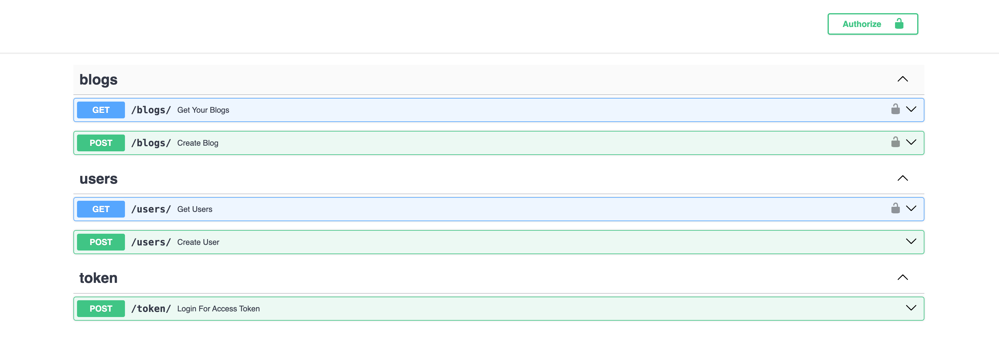

## novel-app-backend

novel-app-backend


### How to run everything?

```shell
docker-compose -f deployment/docker-compose.yml up --build
```

Now, you have a local Postgresql database and a FastApi APP running.

Navigate to `localhost:8080/docs`, you will have a Open-API page ready.


> The template creates two example entities, `User` and `Blog`, to help you start your own development,

- **users**: you can create a user or fetch all users.
- Click the `Authorize` button to login with the user-name and password you just created.
- **blogs**: create a blog for the current user or fetch blogs created by the active user.

Now, you have everything ready and running,


If you prefer to just run the API locally, you can follow the below steps.

### Run API locally

- Install Poetry

```shell
pipx install poetry
```
or
```shell
pip install poetry
```
- Spin up a virtual environment

```shell
poetry shell
```

- Install all dependencies

```shell
poetry install
```

- Start a local database

```shell
docker-compose -f deploy/docker-compose.yml up --build db
```

- Run database migrations

```shell
alembic upgrade head
```


- Start your FastApi APP
```shell
uvicorn src.main:app --host 0.0.0.0 --port 8080
```

